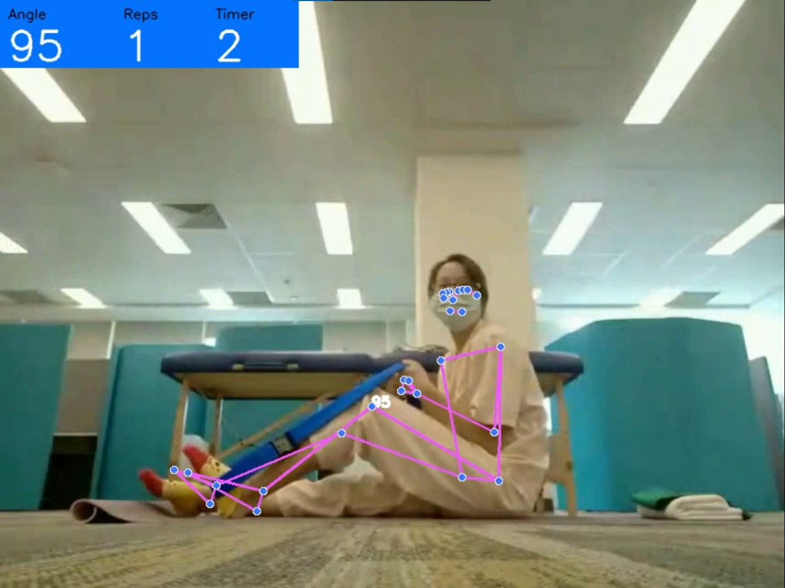

## Pose Detection

A pose detection algorithm that can detect knee bend movements. User stats like bend angle, Reps and hold timer are displayed back to the user in real time.
A robust algorithm is used to minimise the affect of fluctuating keypoints during detection. 

## Input sample:

## Output result:

Programming Language: Python3
Libraries used: OpenCV, Mediapipe, Numpy
